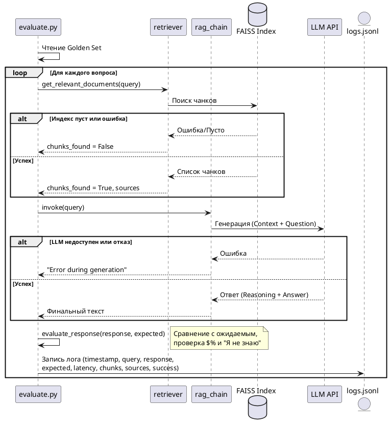

```puml
@startuml
participant "evaluate.py" as eval
participant "retriever" as ret
participant "rag_chain" as rag
database "FAISS Index" as faiss
participant "LLM API" as llm
entity "logs.jsonl" as logs

eval -> eval : Чтение Golden Set
loop Для каждого вопроса
    eval -> ret : get_relevant_documents(query)
    ret -> faiss : Поиск чанков
    alt Индекс пуст или ошибка
        faiss --> ret : Ошибка/Пусто
        ret --> eval : chunks_found = False
    else Успех
        faiss --> ret : Список чанков
        ret --> eval : chunks_found = True, sources
    end

    eval -> rag : invoke(query)
    rag -> llm : Генерация (Context + Question)
    alt LLM недоступен или отказ
        llm --> rag : Ошибка
        rag --> eval : "Error during generation"
    else Успех
        llm --> rag : Ответ (Reasoning + Answer)
        rag --> eval : Финальный текст
    end

    eval -> eval : evaluate_response(response, expected)
    note right: Сравнение с ожидаемым,\nпроверка $% и "Я не знаю"
    
    eval -> logs : Запись лога (timestamp, query, response,\nexpected, latency, chunks, sources, success)
end
@enduml
```
